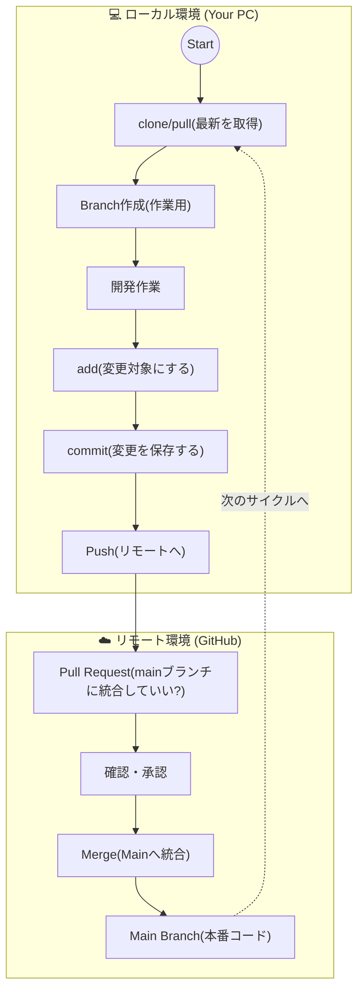

# ０．環境構築

各々調べながら進めていくため、最低限のチェックポイントだけ用意した

---

## ✅ Checkpoint 1: インストール・サインアップ

- [ ]  Git：Git Bashがインストール（GUIで確認）
- [ ]  VScode：VScodeがインストールGUIで確認）
- [ ]  WSL2：cmdで`wsl`を打って、wslに入る
- [ ]  node.js：wsl上で`node -v`を打って、バージョンが表示される
- [ ]  Githubアカウント：ログインもしくはアカウントを作成できる

---

## ✅ Checkpoint 2: gitにgithubを登録

- [ ]  WSL2上で`ssh -T git@github.com` を打って、`Hi <username>! ...` が表示される

---

## ✅ Checkpoint 3: VScodeのセットアップ

- [ ]  vscodeのterminalでwslに入る（作業フォルダは各自用意）

---

## ✅ Checkpoint 4: Github使ってみる

- [ ]  mainにpull Requestを送る

# 補足：Git管理のイメージ

