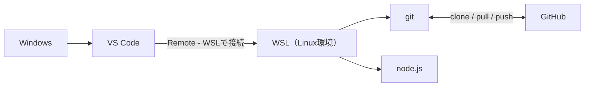

# ０．環境構築

今回構築する環境


```mermaid
flowchart LR
  WIN["Windows"] --> VS["VS Code"]
  VS -->|Remote - WSLで接続| WSL["WSL（Linux環境）"]

  WSL --> GIT["git"]
  WSL --> NODE["node.js"]

  GIT <-->|clone / pull / push| GH["GitHub"]

```

- Windows：大人気OS。本ドキュメントはWindowsの想定だが、Macでも可(WSL,node.jsが不要なだけ)
- VS Code：エディタ。ここでコードを書いたり、gitコマンドを打つ。
- WSL：Linux環境をWindowsで仮想的に使うためのもの。本番環境がLinux前提になりやすく、今の段階から全員の環境をそろえておきたい。
- git：ファイルのバージョン管理をするためのツール。GitHubとの仲介役。
- GitHub：コード置き場。チームで一つのフォルダをもって、バージョン管理しつつ編集できるようにする。
- node.js：Webアプリを開発するために最低限必要な実行環境

各々調べながら進めていくため、最低限のチェックポイントだけ用意した

---

## ✅ Checkpoint 1: インストール・サインアップ

- [ ]  VScode：VScodeがインストールGUIで確認）
- [ ]  WSL2：cmdで`wsl`を実行して、wslに入る
- [ ]  Githubアカウント：ログインもしくはアカウントを作成できる

---

## ✅ Checkpoint 2: VScodeのセットアップ

- [ ]  vscodeのterminalでwslに入る（作業フォルダは各自用意）

---

## ✅ Checkpoint 3: WSL上にインストール

- [ ]  Git：WSL2上で`git --version` を実行して、バージョンが表示される
- [ ]  node.js：wsl上で`node -v`を実行して、バージョンが表示される

---

## ✅ Checkpoint 4: gitにgithubを登録

- [ ]  git clone：wsl上に今回用のリポジトリをコピーできた
- [ ]  ユーザー認証：gitにユーザー名とメールアドレスが設定できた

---

## ✅ Checkpoint 5: Github使ってみる

- [ ]  mainにpull Requestを送る

# 補足：Git管理のイメージ
```mermaid
graph TD
  %% ローカル環境
  subgraph Local ["💻 ローカル環境 (Your PC)"]
    Start((Start))
    Clone["clone/pull(最新を取得)"]
    Branch["Branch作成(作業用)"]
    Edit["開発作業"]
    Add["add(変更対象にする)"]
    Commit["commit(変更を保存する)"]
    Push["Push(リモートへ)"]
  end

  %% GitHub環境
  subgraph Remote ["☁️ リモート環境 (GitHub)"]
	  PR["Pull Request(mainブランチに統合していい?)"]
    Review["確認・承認"]
    Merge["Merge(Mainへ統合)"]
    Main["Main Branch(本番コード)"]
  end
  
  Start --> Clone
  Clone --> Branch
  Branch --> Edit
  Edit --> Add
  Add --> Commit
  Commit --> Push
  Push --> PR
  PR --> Review
  Review --> Merge
  Merge --> Main
  Main -.->|次のサイクルへ| Clone
  ```